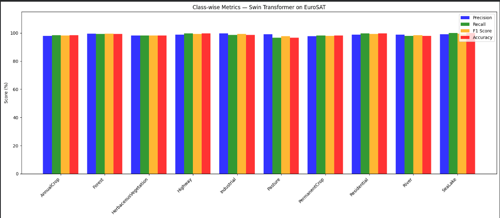
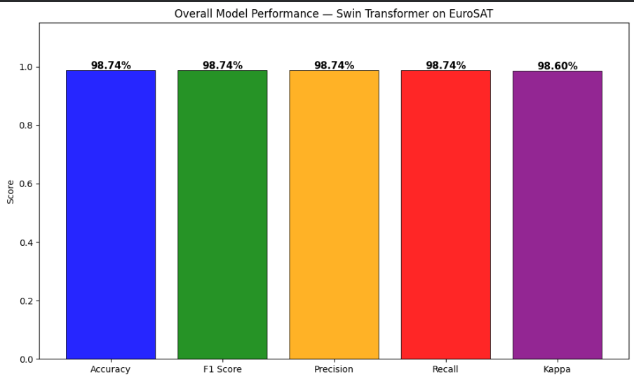
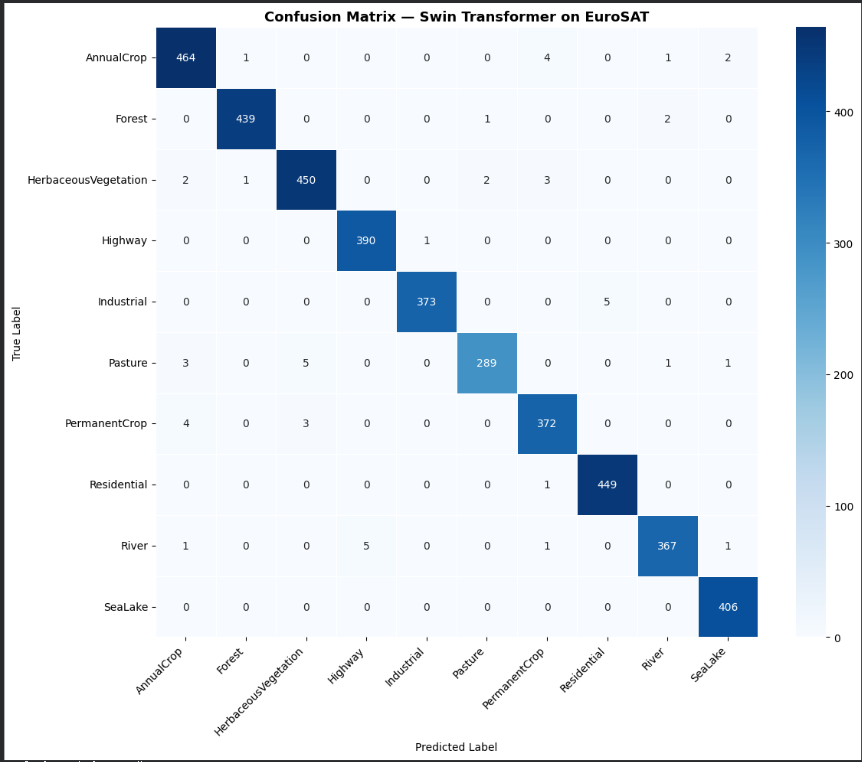

# Satellite Land Cover Classification — Swin Transformer

Fine-tuned a Swin Transformer on EuroSAT satellite images to classify land into 10 categories like forests, rivers, highways, and croplands. Achieved 98.89% test accuracy. Also added Grad-CAM and SHAP to explain what the model is actually looking at.

**What this project does**

Given a satellite image, the model predicts which of 10 land cover types it belongs to:
AnnualCrop, Forest, HerbaceousVegetation, Highway, Industrial, Pasture, PermanentCrop, Residential, River, SeaLake.

The interesting part is the explainability — Grad-CAM highlights which region of the image influenced the prediction, and SHAP breaks it down to individual pixels. So you can actually verify the model is focusing on the right things (field texture for crops, canopy for forests, road lines for highways) rather than just trusting a number.


**Results**

| Metric | Score |
| Test Accuracy | 98.89% |
| F1-Score | 98.89% |
| Cohen's Kappa | 0.9876 |

Compared to other approaches on EuroSAT:
- Regular CNNs get around 88–91%
- YOLOv8 gets around 93%
- CNN-Transformer hybrids reach 96–97%

 **Visualizations**







**Dataset**
EuroSAT — 27,000 Sentinel-2 satellite images across 10 classes.
Split: 70% train / 15% val / 15% test. Images resized to 224×224.

**Model details**

- Architecture: swin_tiny_patch4_window7_224 (27.5M params)
- Pretrained on ImageNet-1K, fine-tuned on EuroSAT
- Optimizer: AdamW, lr=0.0001
- Augmentation: Mixup + CutMix (helps with visually similar classes like AnnualCrop vs PermanentCrop)
- Trained for 4 epochs on Google Colab (Tesla T4 GPU)

**Running the web app**

```bash
pip install streamlit timm torchcam torch torchvision
streamlit run satellite_app.py
```
Upload a satellite image, get the predicted class, and a Grad-CAM heatmap showing what the model focused on.

**Tech used**

Python, PyTorch, timm, torchcam, captum, Streamlit, Google Colab
